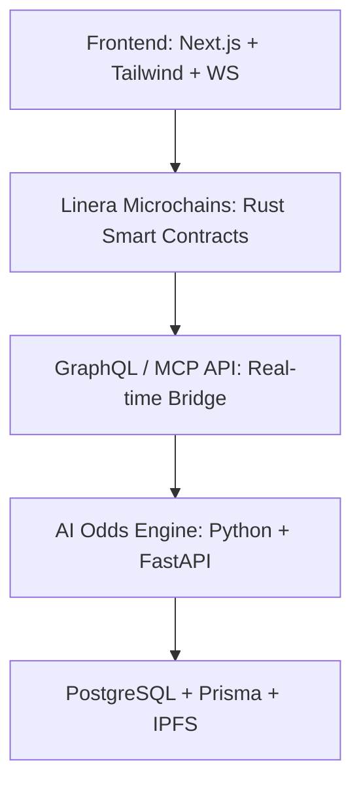

# TradePulse
**Real-Time Micro Prediction Markets Powered by Linera Microchains**

**Tagline:** Bet. Trade. Win — in seconds, not hours.

---

## About TradePulse
**TradePulse** is a next-generation, on-chain micro prediction market platform built on **Linera microchains**. It enables users to place live bets on dynamic events—like sports goals, eSports rounds, or live voting outcomes—with **instant settlement**, AI-driven odds, and real-time updates. By combining **Web2-level responsiveness** with fully decentralized Web3 infrastructure, TradePulse delivers interactive, transparent, and engaging prediction markets that evolve every second.

### Problem Statement
Traditional prediction markets like Polymarket or Augur are **slow, gas-heavy, and static**. Users often wait hours or days for outcomes, with no live engagement or continuously updating odds. This creates a significant performance and UX gap compared to Web2 betting platforms.

### Our Solution
TradePulse solves this by introducing **real-time, micro-scale markets**:
- **Live Micro-Markets:** Short-term markets resolving in seconds or minutes.
- **AI Market Makers:** Automated agents update odds dynamically using live event data.
- **Instant Settlements:** Linera microchains guarantee immediate finality.
- **Dynamic Dashboard:** Leaderboards, odds, and active trades update live.
- **Community Voting & Rewards:** Decentralized governance to validate ambiguous outcomes.

---

## Technologies & Stack

**Frontend:**
- Next.js 15 / React 19
- Tailwind CSS / ShadCN for UI
- Framer Motion for live odds animations
- WebSockets & Linera SDK for real-time data

**Backend / Smart Contracts:**
- Rust + Linera SDK for core market logic
- GraphQL (Linera MCP) for frontend-chain communication
- Python + FastAPI for AI odds engine

**Database / Storage:**
- PostgreSQL + Prisma for market history and analytics
- IPFS (optional) for decentralized event metadata

**Deployment:**
- Linera Testnet (Conway)
- Frontend hosted on Vercel
- CI/CD with GitHub Actions and Docker Compose for local testing

---

## Architecture Overview

## Wave Progress & Roadmap

**Wave 2:**  
Built the core foundation of TradePulse, integrating **frontend** with Linera smart contracts. Enabled **real-time micro-markets**, instant settlements, and live odds via WebSockets. Laid the foundation for dynamic, interactive, and fully decentralized prediction markets.

**Wave 3:**  
Introduce the **AI odds engine** for dynamic market adjustments and a **real-time analytics dashboard** for tracking liquidity, odds, and leaderboards.

**Wave 4:**  
Implement **community voting** and **user reward systems** to increase engagement, gamify trading, and improve governance.

**Wave 5:**  
Enable **multi-event scalability**, allowing users to trade across multiple simultaneous markets without latency or performance issues.

**Wave 6:**  
Launch the **Alpha version on Linera mainnet**, integrating all features for a production-ready, fully decentralized, and interactive prediction market platform.

---

## Key Features
- **Live Micro-Markets:** Events resolve in seconds or minutes.
- **AI Market Makers:** Automatic real-time odds adjustments.
- **Instant Settlement:** No pending transactions, full on-chain finality.
- **Dynamic Dashboard:** Track trades, liquidity, and leaderboards live.
- **Community Governance:** Voting on ambiguous results.
- **Wallet Integration:** Connect wallets and trade instantly with USDC.

---

## Challenges & Learnings
- Handling millisecond-level updates via WebSockets while maintaining reliability.
- Designing Rust contracts for micro-event resolution without state conflicts.
- Achieving Web2-level UX while remaining fully decentralized.
- Understanding how **Linera microchains** enable low-latency, real-time on-chain applications.

---

## Impact
TradePulse demonstrates the potential of **Linera microchains** for building truly interactive, low-latency Web3 apps. It bridges the gap between Web2 betting apps and decentralized markets, creating a new category of **live DeFi entertainment**.

---

## Live Demo & Repository
- Live Demo: [https://tradepulse-gules.vercel.app/](https://tradepulse-gules.vercel.app/)
- Repository: [https://github.com/Guantaijp/tradepulse](https://github.com/Guantaijp/tradepulse)

---

## Team
**John Paul Guantai** – Project Lead / Full Stack Developer  
- Frontend, Linera SDK, Rust smart contracts, AI odds engine

---

## Tech Tags
Next.js · Tailwind CSS · ShadCN · Rust · Linera SDK · GraphQL · Prisma · PostgreSQL · Python · FastAPI · WebSockets

